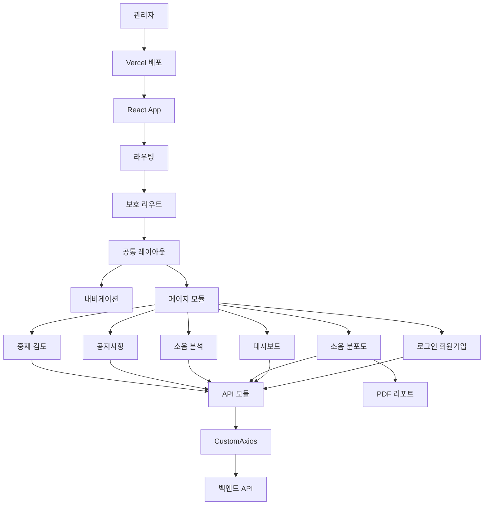

# 쿵로그 관리사무소용 웹
쿵로그 관리사무소용 웹 리포지토리입니다. 

## 프로젝트 소개

쿵로그 관리사무소용 웹은 공동주택 관리사무소가 층간소음 데이터를 기반으로 세대 현황을 모니터링하고, 공지 발송과 중재 메시지 검토까지 수행할 수 있도록 구현한 React 기반 관리자 웹 애플리케이션입니다.

관리자는 대시보드에서 세대별 소음 발생 현황, 긴급 대응 필요 세대, 오늘 발생한 소음 이벤트, 조치 완료 건수 등을 확인할 수 있습니다. 또한 소음 분포도와 시간대별 소음 분석 화면을 통해 건물·세대 단위의 소음 발생 패턴을 파악하고, 필요한 경우 특정 세대에 메시지를 발송하거나 주민 앱 공지를 작성할 수 있습니다.

본 저장소는 쿵로그 서비스의 프론트엔드 웹 파트이며, 백엔드 API와 연동된 관리자용 화면을 제공합니다. 팀 프로젝트로 진행되었으며, 프론트엔드 구현은 단독으로 담당했습니다.

* 배포 URL: https://koonglog.vercel.app/
* 프론트엔드 저장소: `koonglog/front_web`
* 백엔드 연동 방식: `REACT_APP_BASE_URL` 환경 변수를 통한 API 서버 주소 주입

---

## 🙌 팀원 소개

|홍지현|
|:---:|
||
|[@Hongji03](https://github.com/Hongji03)|

---

## 문제 정의

층간소음 문제는 단순한 민원 접수에 그치지 않고, 반복 발생 여부, 시간대, 소음 강도, 세대별 패턴, 중재 이력 등을 함께 확인해야 효과적으로 대응할 수 있습니다. 관리사무소 입장에서는 여러 데이터를 분산해서 확인하기보다, 하나의 관리자 화면에서 소음 현황을 파악하고 필요한 조치를 빠르게 수행할 수 있는 도구가 필요합니다.

쿵로그 관리사무소용 웹은 다음과 같은 문제를 해결하기 위해 구현되었습니다.

* 세대별 소음 발생 현황을 한눈에 확인하기 어려운 문제
* 긴급 대응이 필요한 세대를 빠르게 식별하기 어려운 문제
* 시간대별 소음 패턴과 기준치 초과 현황을 직관적으로 파악하기 어려운 문제
* 공지사항과 개별 세대 메시지를 별도 도구 없이 관리해야 하는 문제
* AI가 생성한 중재 메시지를 관리자가 검토하고 승인하는 흐름이 필요한 문제
* 관리자 인증, API 연동, 배포 환경 설정을 갖춘 실제 웹 서비스 형태의 프론트엔드가 필요한 문제

---

## 주요 기능

### 1. 관리자 인증

* 로그인 API 연동
* 회원가입 API 연동
* 로그인 성공 시 `accessToken`, `tokenType`, 관리자 정보를 `localStorage`에 저장
* 인증 토큰 기반 보호 라우트 구성
* 로그아웃 API 연동
* 관리자 프로필 조회 API 구성

관련 파일:

* `src/api/authApi.js`
* `src/pages/login/Login.jsx`
* `src/pages/signup/SignUp.jsx`
* `src/routes/ProtectedRoute.jsx`

### 2. 대시보드

* 전체 모니터링 세대 수 조회
* 긴급 대응 필요 세대 수 조회
* 오늘 발생 소음 수 조회
* 조치 완료 건수 조회
* 세대 목록 조회 및 검색
* 선택 세대의 최근 소음 이벤트 조회
* 전체 시간대별 발생 현황 그래프 표시
* 최근 감지된 소음 이벤트 피드 표시
* 건물별 갈등 핫스팟 맵 표시
* 특정 세대 대상 메시지 발송 모달 제공

관련 파일:

* `src/pages/dashboard/Dashboard.jsx`
* `src/api/dashboardApi.js`
* `src/components/dashboard/SendMessageModal.jsx`

### 3. 소음 분포도

* 건물별·세대별 소음 발생 데이터 조회
* 위험도에 따른 색상 기반 시각화
* 긴급 대응 필요, 관찰 필요, 정상 상태 구분
* 소음 분포도 데이터를 PDF로 내보내기
* `jsPDF`, `jspdf-autotable`을 사용한 표 형태 리포트 생성
* 한글 깨짐 방지를 위한 Pretendard 폰트 로딩 처리

관련 파일:

* `src/pages/distribution/Distribution.jsx`
* `src/api/noiseApi.js`
* `src/assets/font`

### 4. 소음 분석

* 최근 24시간, 12시간, 3시간, 1시간 필터 제공
* 최근 1시간 선택 시 5분 단위 분석
* 그 외 기간은 시간 단위 분석
* 주간 기준 39dB, 야간 기준 34dB 초과 세대 수 계산
* 야간 최다 초과 시간, 주간 최다 초과 시간, 총 초과 세대, 정상 시간대 요약

관련 파일:

* `src/pages/loganalysis/LogAnalysis.jsx`
* `src/api/dashboardApi.js`

### 5. 공지사항

* 공지사항 목록 조회
* 전체 발송 수, 평균 확인율, 최근 발송일, 전체 수신자 수 표시
* 공지사항 상세 조회
* 공지사항 작성 및 발송
* 전체 발송 또는 특정 동/호수 선택 발송
* AI 템플릿 추천 모달 적용
* 예약 발송 모달 적용
* 공지 유형 선택

  * 긴급 알림
  * 일반 공지
  * 생활 에티켓
  * 장비 점검 안내

관련 파일:

* `src/pages/notice/Notice.jsx`
* `src/pages/notice/NoticeDetail.jsx`
* `src/pages/notice/NoticeWrite.jsx`
* `src/api/noticeApi.js`
* `src/components/notice/AiTemplateModal.jsx`
* `src/components/notice/ScheduleSendModal.jsx`

### 6. 중재 메시지 검토

* 승인 대기 중재 메시지 조회
* 완료된 중재 메시지 조회
* 원본 민원 메시지 표시
* AI 생성 중재 메시지 표시
* 민원 세대가 희망한 조용한 시간대 표시
* 관리자가 AI 메시지를 승인하고 완료 상태로 변경
* 승인 후 완료 탭으로 이동하는 UI 흐름 구현

관련 파일:

* `src/pages/review/Review.jsx`
* `src/api/mediationApi.js`

### 7. 센서 상태 API 구성

* 센서 상태 조회 API 모듈 구성
* 전체 센서 수, 온라인 센서 수, 평균 배터리, 보정 필요 여부 등 백엔드 응답을 받을 수 있는 구조

관련 파일:

* `src/api/sensorApi.js`

---

## 기술 스택

### Frontend

* React
* React DOM
* React Router DOM
* JavaScript
* SCSS / Sass

### API 통신

* Axios
* Custom Axios Instance
* REST API 연동
* 환경 변수 기반 API Base URL 관리

### PDF Export

* jsPDF
* jspdf-autotable
* Pretendard 폰트 적용

### Build / Deploy

* Create React App
* react-scripts
* Vercel

---

## 아키텍처 및 구조



* `관리자`: 관리사무소 담당자가 사용하는 웹 관리자 화면입니다.
* `Vercel 배포`: 프론트엔드 애플리케이션이 Vercel에 배포되어 있습니다.
* `React App`: `src/index.js`, `src/App.js`를 중심으로 실행되는 SPA입니다.
* `라우팅`: `src/App.js`에서 로그인, 회원가입, 대시보드, 공지사항, 중재 검토 등 페이지 경로를 관리합니다.
* `보호 라우트`: `src/routes/ProtectedRoute.jsx`에서 인증이 필요한 페이지 접근을 제어합니다.
* `공통 레이아웃`: `src/layouts/RootLayout.jsx`에서 공통 내비게이션과 페이지 출력 구조를 담당합니다.
* `내비게이션`: `src/components/common/Nav.jsx`에서 주요 관리자 메뉴를 제공합니다.
* `페이지 모듈`: `src/pages` 하위의 기능별 디렉터리에서 화면을 분리합니다.
* `API 모듈`: `src/api` 하위 파일에서 기능별 API 호출을 분리합니다.
* `CustomAxios`: `src/api/CustomAxios.js`에서 `REACT_APP_BASE_URL` 기반의 Axios 인스턴스를 생성합니다.
* `PDF 리포트`: `src/pages/distribution/Distribution.jsx`에서 `jsPDF`, `jspdf-autotable`, Pretendard 폰트를 사용해 소음 분포도 리포트를 생성합니다.
* `백엔드 API`: 프론트엔드는 백엔드 API와 REST 방식으로 통신합니다.

전체 구조는 `라우팅 → 레이아웃 → 페이지 → API 모듈 → 백엔드 API` 흐름으로 구성되어 있습니다. 화면 컴포넌트는 데이터 요청을 직접 작성하지 않고, `src/api`에 분리된 API 함수를 호출하는 방식으로 구성되어 있어 기능별 유지보수가 쉽습니다.

또한 대시보드, 공지사항, 중재 메시지, 소음 분석 등 관리 기능이 페이지 단위로 분리되어 있습니다. 이를 통해 각 기능의 상태 관리, 로딩 처리, 에러 처리, 데이터 포맷팅 로직을 해당 화면 안에서 독립적으로 관리할 수 있습니다.

---

## 핵심 구현 포인트

### 1. 기능별 API 모듈 분리

API 호출 로직을 화면 컴포넌트에 직접 흩어놓지 않고, `src/api` 폴더에 기능별로 분리했습니다.

* `authApi.js`: 로그인, 로그아웃, 회원가입, 관리자 프로필 조회
* `dashboardApi.js`: 대시보드 통계, 세대 목록, 시간대별 소음, 최근 로그, 핫스팟 조회
* `noiseApi.js`: 소음 분포도 조회 및 내보내기 데이터 조회
* `noticeApi.js`: 공지 목록, 상세, 작성, AI 템플릿, 동별 세대 목록 조회
* `mediationApi.js`: 중재 메시지 목록 조회 및 상태 업데이트
* `sensorApi.js`: 센서 상태 조회

이 구조를 통해 API 엔드포인트가 변경되더라도 화면 컴포넌트 전체를 수정하지 않고 API 모듈만 중심으로 관리할 수 있습니다.

### 2. 환경 변수 기반 백엔드 주소 관리

`CustomAxios.js`에서 `process.env.REACT_APP_BASE_URL`을 사용해 API 서버 주소를 관리합니다. 이를 통해 로컬 개발 환경과 배포 환경에서 백엔드 주소를 분리할 수 있도록 구성했습니다.

```js
const CustomAxios = axios.create({
  baseURL: process.env.REACT_APP_BASE_URL,
  headers: {
    "Content-Type": "application/json",
  },
  withCredentials: true,
});
```

환경 변수는 백엔드 배포 주소를 관리하는 용도로 사용됩니다.

### 3. 인증 정보 저장과 보호 라우트 구성

로그인 성공 시 백엔드에서 받은 `access_token`, `token_type`, 관리자 정보를 `localStorage`에 저장합니다. 이후 보호 라우트에서 토큰 존재 여부를 기준으로 인증이 필요한 화면 접근을 제어합니다.

이 방식은 새로고침 이후에도 로그인 상태를 유지할 수 있고, 관리자 페이지 접근 권한을 프론트엔드 라우팅 단계에서 제어할 수 있다는 장점이 있습니다.

### 4. 대시보드 데이터 시각화

대시보드에서는 백엔드에서 받은 데이터를 관리자 업무 흐름에 맞게 가공해 표시합니다.

* 전체 통계 카드
* 세대별 상태 리스트
* 최근 소음 이벤트 피드
* 시간대별 발생 그래프
* 건물별 핫스팟 맵
* 선택 세대 상세 정보
* 세대별 메시지 발송 모달

특히 시간대별 발생 현황은 필터에 따라 데이터를 다시 조회하고, 응답 데이터를 그래프 표시용 형태로 변환해 사용합니다.

### 5. 소음 기준 기반 분석 로직

소음 분석 화면에서는 최근 로그 데이터를 기준으로 주간과 야간의 기준치를 다르게 적용합니다.

* 주간 기준: 39dB 이상
* 야간 기준: 34dB 이상
* 최근 1시간: 5분 단위 분석
* 그 외 기간: 시간 단위 분석

단순히 서버 응답을 출력하는 것이 아니라, 프론트엔드에서 시간 구간을 만들고, 각 구간별 기준치 초과 세대 수를 집계하여 시각화합니다.

### 6. PDF 리포트 내보내기

소음 분포도 화면에서는 백엔드에서 내보내기용 데이터를 조회한 뒤, `jsPDF`와 `jspdf-autotable`을 사용해 PDF 리포트를 생성합니다.

한글 텍스트가 깨지지 않도록 Pretendard TTF 파일을 불러와 base64로 변환한 뒤, PDF 내부 폰트로 등록하여 한글 제목과 표 데이터를 정상적으로 출력하도록 구현했습니다. 이를 통해 브라우저에서 바로 소음 분포도 리포트를 다운로드할 수 있도록 구현했습니다.

### 7. 공지사항 작성과 예약 발송 흐름

공지사항 작성 화면에서는 전체 발송과 특정 세대 발송을 모두 지원합니다. 특정 세대 발송의 경우 동을 먼저 선택하고, 해당 동의 세대를 선택하는 2단계 UI로 구성했습니다.

또한 AI 템플릿 추천 모달과 예약 발송 모달을 분리하여 공지 작성 흐름을 확장 가능한 형태로 구성했습니다.

### 8. AI 중재 메시지 승인 흐름

중재 메시지 검토 화면에서는 승인 대기 목록과 완료 목록을 분리하여 보여줍니다. 관리자가 AI 생성 메시지를 확인한 뒤 승인하면, 해당 메시지의 상태를 `completed`로 업데이트하고 완료 탭으로 이동합니다.

이 구조는 AI가 생성한 내용을 관리자가 최종 확인하는 Human-in-the-loop 흐름을 프론트엔드에서 구현한 사례입니다.

---

## 트러블슈팅 및 기술적 고민

### 1. API 서버 주소를 배포 환경에 맞게 분리

프론트엔드 배포 환경에서는 로컬 서버 주소를 직접 사용할 수 없기 때문에, 백엔드 배포 주소를 환경 변수로 분리했습니다. `CustomAxios`에서 `REACT_APP_BASE_URL`을 참조하도록 구성하여 Vercel 배포 환경에서도 동일한 코드로 API 서버를 바라볼 수 있도록 했습니다.

### 2. 로그인 상태 유지와 라우트 보호

관리자 웹은 로그인하지 않은 사용자가 접근하면 안 되는 화면이 많습니다. 로그인 성공 시 토큰과 관리자 정보를 `localStorage`에 저장하고, 보호 라우트에서 토큰 여부를 확인하는 방식으로 인증 흐름을 구성했습니다.

### 3. 소음 분석 데이터 가공

소음 로그 데이터는 그대로 출력하는 것보다 시간대별로 묶어 보여주는 것이 관리자에게 더 유용합니다. 따라서 최근 1시간은 5분 단위, 그 외 기간은 시간 단위로 구간을 나누고, 주간·야간 기준치를 다르게 적용하여 초과 세대 수를 계산했습니다.

### 4. PDF 한글 폰트 깨짐 처리

`jsPDF`는 기본 폰트만 사용할 경우 한글이 깨질 수 있습니다. 이를 해결하기 위해 Pretendard TTF 파일을 불러와 base64로 변환한 뒤, PDF 내부 폰트로 등록하여 한글 제목과 표 데이터를 정상적으로 출력하도록 구현했습니다.

### 5. 공지 발송 대상 선택 UI

공지사항은 전체 발송뿐 아니라 특정 동/호수 대상 발송이 필요합니다. 이를 위해 동별 세대 목록 API를 사용하고, 선택된 세대를 별도 상태로 관리하여 다중 선택과 선택 해제를 처리했습니다.

### 6. AI 생성 메시지의 관리자 승인 흐름

AI가 생성한 중재 메시지를 곧바로 발송하지 않고, 관리자가 검토한 뒤 승인하는 구조로 구현했습니다. 이를 통해 자동화와 관리자의 최종 판단이 함께 반영되는 업무 흐름을 구성했습니다.

---

## 폴더 구조

```text
front_web
├── public
├── src
│   ├── api
│   │   ├── CustomAxios.js
│   │   ├── authApi.js
│   │   ├── dashboardApi.js
│   │   ├── mediationApi.js
│   │   ├── noiseApi.js
│   │   ├── noticeApi.js
│   │   └── sensorApi.js
│   ├── assets
│   │   ├── font
│   │   ├── img
│   │   └── scss
│   ├── components
│   │   ├── common
│   │   ├── dashboard
│   │   └── notice
│   ├── layouts
│   │   └── RootLayout.jsx
│   ├── mocks
│   ├── pages
│   │   ├── dashboard
│   │   ├── distribution
│   │   ├── extservice
│   │   ├── home
│   │   ├── loganalysis
│   │   ├── login
│   │   ├── mypage
│   │   ├── notice
│   │   ├── review
│   │   └── signup
│   ├── routes
│   │   └── ProtectedRoute.jsx
│   ├── App.js
│   └── index.js
├── package.json
├── package-lock.json
└── README.md
```

### 주요 폴더 설명

* `src/api`: 백엔드 API 호출 함수 관리
* `src/assets`: 이미지, 폰트, SCSS 등 정적 자산 관리
* `src/components/common`: 내비게이션, 프로필 드롭다운 등 공통 컴포넌트
* `src/components/dashboard`: 대시보드 관련 컴포넌트
* `src/components/notice`: 공지사항 작성 관련 모달 컴포넌트
* `src/layouts`: 공통 레이아웃 관리
* `src/pages`: 라우트 단위 페이지 컴포넌트 관리
* `src/routes`: 보호 라우트 관리
* `src/App.js`: 전체 라우팅 정의
* `src/index.js`: React 앱 진입점

---

## 배운 점

* React Router를 활용해 관리자 웹의 인증 화면과 보호된 관리자 화면을 분리하는 방법을 학습했습니다.
* Axios 인스턴스를 별도로 구성하고, 기능별 API 모듈을 분리하여 API 연동 코드를 유지보수하기 쉽게 구성했습니다.
* 백엔드 응답 데이터를 그대로 출력하는 것이 아니라, 관리자 화면에 적합한 형태로 가공하고 시각화하는 과정을 경험했습니다.
* 시간대별 소음 분석처럼 기준치와 기간 필터가 필요한 데이터를 프론트엔드에서 가공하는 방법을 익혔습니다.
* `jsPDF`, `jspdf-autotable`, 커스텀 한글 폰트를 활용해 브라우저에서 PDF 리포트를 생성하는 방법을 구현했습니다.
* 전체 발송, 선택 세대 발송, 예약 발송 등 실제 관리자 업무 흐름을 고려한 UI 상태 관리 방식을 경험했습니다.
* AI 생성 메시지를 관리자가 검토하고 승인하는 Human-in-the-loop 방식의 화면 흐름을 구현했습니다.
* Vercel 배포와 환경 변수 기반 백엔드 주소 관리를 통해 프론트엔드 배포 환경을 구성했습니다.

---

## 향후 개선 사항

* 주요 컴포넌트와 API 연동 로직에 대한 테스트 코드 추가
* Axios 인터셉터를 활용한 토큰 만료 처리 및 공통 에러 처리 개선
* 로그인 만료, 서버 장애, 네트워크 오류에 대한 사용자 피드백 강화
* 차트 컴포넌트 분리 및 재사용성 개선
* 공지사항 작성 화면의 임시 저장 기능 추가
* PDF 리포트 디자인 개선 및 다운로드 항목 확장
* 접근성 개선

  * 키보드 탐색
  * 대체 텍스트 보강
  * 명확한 포커스 스타일 제공
* 모바일 또는 태블릿 환경 대응을 위한 반응형 개선
* 관리자 권한별 접근 제어 기능 확장
* 배포 자동화 문서 보강
